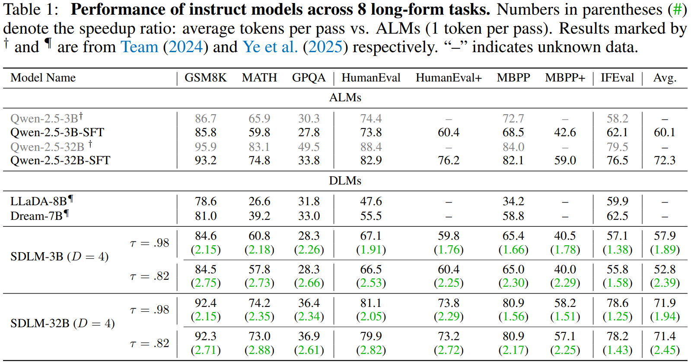

<div align="center">
    
# Sequential Diffusion Language Models

[](https://huggingface.co/papers/2509.24007)
[](https://internvl.github.io/blog/2025-09-29-SDLM/)
[](https://huggingface.co/collections/OpenGVLab/sdlm-68ac82709d7c343ad36aa552)

</div>

## News

* 🎉 **2025-09-30:** We release the [SDLM](https://huggingface.co/papers/2509.24007). Sequential Diffusion Language Model (SDLM) enhances pre-trained autoregressive language models by adaptively determining generation length and maintaining KV-cache compatibility, achieving high efficiency and throughput.
* 🚀 **2025-09-29:** We provide the complete [training and inference code](https://github.com/OpenGVLab/SDLM) for SDLM, and provide the training [dataset](https://github.com/OpenGVLab/SDLM/blob/7aeff4bd98b563a6cc7eb028c0f06556af8d4edb/readme.md?plain=1#L173) and configuration.

## Contents

- [Model Zoo](#modelzoo)
- [Introduction](#introduction)
- [Inference](#inference)
- [Train](#train)
- [Evaluation](#evaluation)

## Todo List

- [x] Model Zoo
- [x] Inference
- [x] Training
- [x] Evaluation
- [x] Technical Report

## ModelZoo
In the following table, we provide an overview of the <a herf="https://huggingface.co/collections/OpenGVLab/sdlm-68ac82709d7c343ad36aa552">SDLM series</a>.

| Model Name  | Base Model 🤗                                                 | HF Link 🤗                                    |
| ----------- | ------------------------------------------------------------ | -------------------------------------------- |
| SDLM-3B-D4  | <a href="https://huggingface.co/Qwen/Qwen2.5-3B">Qwen2.5-3B</a> | https://huggingface.co/OpenGVLab/SDLM-3B-D4  |
| SDLM-3B-D8  | <a href="https://huggingface.co/Qwen/Qwen2.5-3B">Qwen2.5-3B</a> | https://huggingface.co/OpenGVLab/SDLM-3B-D8  |
| SDLM-32B-D4 | <a href="https://huggingface.co/Qwen/Qwen2.5-32B">Qwen2.5-32B</a> | https://huggingface.co/OpenGVLab/SDLM-32B-D4 |

## Introduction

### Overall

We propose a **S**equential **D**iffusion **L**anguage **M**odel (**SDLM**), to cheaply stimulate the parallel prediction capabilities of diffusion models.


- Autoregression: Predicts tokens one by one.
- Diffusion: Regenerates all tokens each step.
- SDLM (ours): Decodes D tokens per step, then **keeps the longest consecutive n confident tokens** (1 ≤ n ≤ D). Cached tokens are reused, saving computation. 

SDLM delivers strong performance with significantly faster decoding speed.
It operates approximately 2x faster than comparable autoregressive models while matching their accuracy, and achieves up to 5x speedup over other diffusion language models, as evidenced by results on the MATH-500 benchmark.


### Methods


**(a) Training pipeline**

The reordered input sequence enables structured masking with:
- Causal prefix (top-left)
- Visible cross-block prefix (bottom-left)
- Intra-block bidirectional attention (bottom-right)

**(b) Sampling Pipeline**

Confidence-based dynamic block decoding with KV cache reuse. 
At each step, a block of $D$ tokens is predicted with $D{-}1$ padding masks. The longest high-confidence prefix is selected as dynamic output. Cached KV states enable efficient decoding.

### Performance

SDLM-32B scores 92.4 (GSM8K), 74.2 (MATH), 78.6 (IFEval), and remains competitive on HumanEval (81.1) and MBPP (80.9). Our smaller 3B model outperforms similar-sized models and larger diffusion-based alternatives with limited training.

For efficiency, each forward pass generates ∼2 tokens on average, achieving ≈2× speedup and two-thirds latency of AR models.



<p align="center">
    </a>
</p>

### Trade-off Between Performance and Speed

Trade-off between performance and speed under different confidence thresholds $\tau$ for SDLM-3B (D=4) and SDLM-3B (D=8).

By adjusting $\tau$, a controllable trade-off between speed and performance can be achieved. SpeedUp denotes the average number of tokens output per forward pass.


## Inference

<details>
  <summary>With HuggingFace</summary>

```python
import torch
from transformers import AutoModelForCausalLM, AutoTokenizer
from sdlm_inference import SDLM_generate

if __name__ == "__main__":
    ckpt_hf = 'OpenGVLab/SDLM-3B-D4'

    model = AutoModelForCausalLM.from_pretrained(
        ckpt_hf, 
        attn_implementation="eager",
        trust_remote_code=True
    ).to(dtype=torch.float16)
    tokenizer = AutoTokenizer.from_pretrained(ckpt_hf)

    prompt = 'Write a Fibonacci function in Python.'
    messages = [
        {"role": "system", "content": "You are a helpful assistant."},
        {"role": "user", "content": prompt}
    ]
    text = tokenizer.apply_chat_template(
        messages,
        tokenize=False,
        add_generation_prompt=True
    )

    model_inputs = tokenizer([text], return_tensors="pt").to(model.device)

    response, history = SDLM_generate(
        model,
        tokenizer,
        model_inputs,
        max_gen_len = 1024,
        temperature = 0,
        threshold = 0.5,
        n_future_tokens = 4,
        alg = 'prob_conf', #  prob_conf | entropy_conf | self_speculative
        save_history = True,
        use_cache = True
    )

    print('response: ', response[0])

    print('=======histroy')
    for item in history:
        print('cur total token ', item[1])
        print(item[0][0])
        print('--------')
```

</details>

## Train

1. Environment Setup

    ```bash
    git clone https://github.com/OpenGVLab/SDLM.git
    cd SDLM
    ```

2. Install Dependencies

    Key package versions:
    ```
    transformers==4.37.2
    deepspeed==0.16.5
    torch>=2.5.0
    accelerate==0.32.1
    ```
    **Note**: Additional setup is required if using Flex Attention.


3. Prepare Training Data

    The training dataset we used is specified in the meta file: [meta.json](shell/playground/data/meta/sft_opc436k_scale_math_1m_smoltalk_1m_tulu_1m.json) and is organized in the ShareGPT style, according to the [InternVL chat data format](https://internvl.readthedocs.io/en/latest/get_started/chat_data_format.html). The script [preprocess_scalequestmath.py](utils/data_process/preprocess_scalequestmath.py) serves as a reference implementation.
    
    This dataset is composed of several open-source datasets, with the following structure:
    
    | Dataset Name                                                                               | # Sample   | Domain  |
    | ------------------------------------------------------------------------------------------ | ---------- | ------- |
    | <a href="https://huggingface.co/datasets/dyyyyyyyy/ScaleQuest-Math">ScaleQuest-Math</a>    |  1,000K    | Math    |
    | <a href="https://huggingface.co/datasets/OpenCoder-LLM/opc-sft-stage2">Opc-sft-stage2</a>  |  436K      | Code    |
    | <a href="https://huggingface.co/datasets/HuggingFaceTB/smoltalk">Smoltalk</a>              |  1,100K    | General |
    | <a href="https://huggingface.co/datasets/allenai/tulu-3-sft-mixture">Tulu-3-sft-mixture</a> |  939K     | General |
    | <a href="https://huggingface.co/datasets/allenai/SciRIFF">SciRIFF</a>                      |  79K       | Scienece|
    | <a href="https://huggingface.co/datasets/LipengCS/Table-GPT">Table-GPT</a>                 |  13K       | Table   |
    | **Total**                                                                                      |  **3,506K**    |  --     |


4. Start Training

    All training scripts are available in the [shell/train](shell/train) directory. Key parameters include:
    - `block_size`: The size of the diffusion window. Current settings use `4`, we also try to use `8`; larger sizes are under exploration.
    - `attn_implementation`: Attention implementation type. Options include sdpa, eager, or flex_attn. Using Flex Attention requires additional setup. Prefer to use `sdpa` for a quick start.
    - `causal_attn`: Whether to use causal attention within the window. Currently set to non-causal (`False`).

    Our training setting is:

    <p align="center">
        </a>
    </p>

    The training loss of our 3B model. loss_pos_`i` refers to the loss at the `i`-th position of each block. The loss at `i=0` is close to the SFT loss of AR's NTP.

    Here, we display the loss corresponding to each position within the window during the training process. When bs=8, only the first 4 are shown.
    The correspondence is as follows:

    bs = 4 (red):

    | x  | m  | m  | m  | 
    | -- | -- | -- | -- | 
    | loss_pos_1 | loss_pos_2 | loss_pos_3 |  loss_pos_4 | 

    bs = 8 (orange):

    | x  | m  | m  | m  | m  | m  | m  | m |
    | -- | -- | -- | -- | -- | -- | -- |-- |
    | loss_pos_1 | loss_pos_2 | loss_pos_3 |  loss_pos_4 | -- | -- | -- | -- |

    


## Evaluation

Currently, we use [Opencompass](https://github.com/open-compass/opencompass) for evaluation. For more details, please refer to the [evaluation guide](eval/with_opencompass/readme.md).

## Case

<p align="center">
    </a>
</p>

## Acknowledge

We extend our gratitude to the open-source community for their foundational contributions:

- [InternVL](https://github.com/OpenGVLab/InternVL/tree/main) The codebase we build upon.
- [SMDM](https://github.com/ML-GSAI/SMDM), [LLaDA](https://github.com/ML-GSAI/LLaDA), [Dream](https://github.com/HKUNLP/Dream), [Block Diffusion](https://github.com/kuleshov-group/bd3lms) for insights into diffusion-based generative modeling.
- [Qwen2.5](https://qwenlm.github.io/blog/qwen2.5-llm/) as a robust base model for comparative studies.
- [Opencompass](https://github.com/open-compass/opencompass) for providing a comprehensive evaluation framework.
- The creators of all datasets used in this work, enabling rigorous training and validation.

</details>


## Citation

```bibtex
@article{liu2025sdlm,
  title={Sequential Diffusion Language Models},
  author={Liu, Yangzhou and Cao, Yue and Li, Hao and Luo, Gen and Chen, Zhe and Wang, Weiyun and Liang, Xiaobo and Qi, Biqing and Wu, Lijun and Tian, Changyao and Zhang, Yanting and Li, Yuqiang and Lu, Tong and Qiao, Yu and Dai, Jifeng and Wang, Wenhai},
  journal={arXiv preprint arXiv:2509.24007},
  year={2025}
}
```
